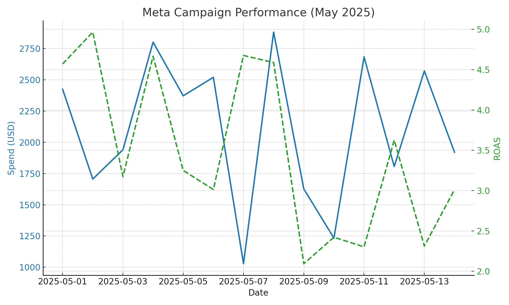

<html lang="en">
<head>
  <meta charset="UTF-8" />
  <meta name="viewport" content="width=device-width, initial-scale=1.0"/>
  <title>Analytics Platform</title>
  
  
</head>
<body>

<header>
  <h1>Analytics Platform</h1>
  
Advanced Marketing Performance Tracking for Meta Advertisers

</header>

<section>
  <h2>What We Do</h2>
  

    Ben Chan Tech, LLC runs a private analytics platform built for performance-driven eCommerce brands. 
    Our system connects directly with the <strong>Meta Marketing API</strong> to help businesses monitor and optimize their ad campaigns on Facebook and Instagram.
  

  

    Our clients authenticate their Meta ad accounts through our secure system. We use the data solely to enrich performance reporting, 
    allowing businesses to calculate critical KPIs like ROAS and Contribution Margin.
  

</section>

<section>
  <h2>Key Features</h2>
  

    

      <h3>Meta API Integration</h3>
      
Secure, OAuth-based connections to Meta ad accounts for real-time data syncing.

    

    

      <h3>Cross-Channel Reporting</h3>
      
Merge Meta campaign data with other platforms like Google Ads, Shopify, or Amazon.

    

    

      <h3>Financial Metrics</h3>
      
Track ROAS, Contribution Margin, blended spend, and other key financial insights.

    

    

      <h3>Client-Owned Data</h3>
      
All data remains securely stored in the client’s account—never sold, shared, or brokered.

    

  

</section>

<section>
  <h2>Example Dashboard</h2>
  
Below is a sample visualization of how clients use our reporting tools.

  
</section>

</body>
</html>
